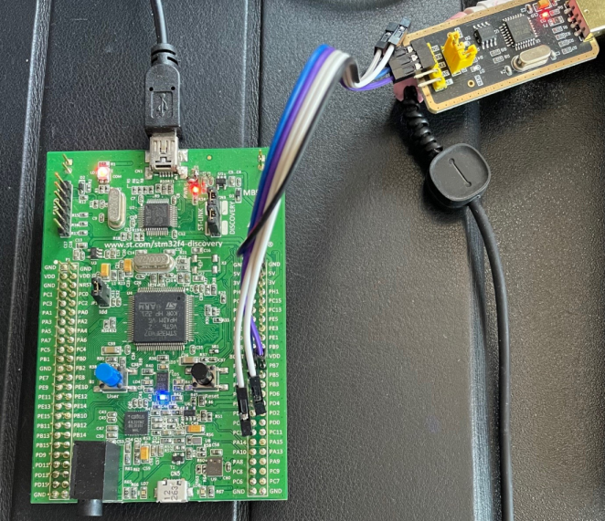
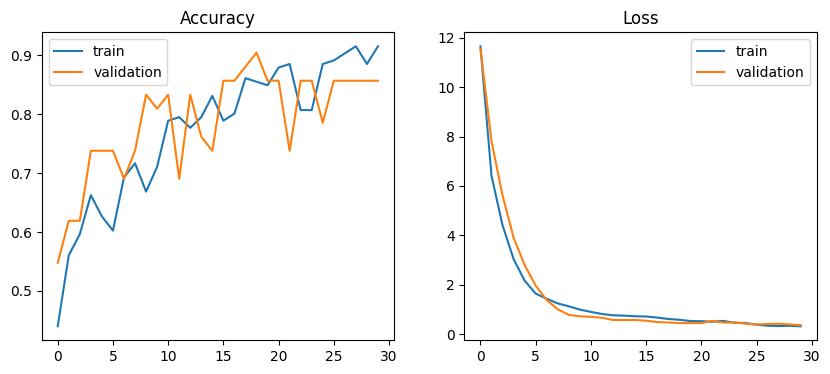

# gesto
This project implements a gesture recognition system based on accelerometer data, running on the `STM32F4 Discovery` development board, using the Rust programming language and TinyML for lightweight machine learning inference.

## Hardware
`STM32F4-Discovery Board` - STM32F407VGT6 microcontroller featuring 32-bit Arm® Cortex-M4 with FPU core, 1-Mbyte flash memory and 192-Kbyte RAM in an LQFP100 package and frequency up to 168 MHz.

[Data Sheet](https://www.st.com/resource/en/datasheet/dm00037051.pdf)

[Schematic](https://www.st.com/resource/en/schematic_pack/mb997-f407vgt6-b02_schematic.pdf)




### Memory layout

```cpp
---------------------------
|      MEMORY LAYOUT      |
---------------------------
| SRAM                    |
| 0x20000000 - 0x2001FFFF |
---------------------------
| CCM data RAM - STACK    |
| 0x10000000 - 0x1000FFFF |
---------------------------
| FLASH                   |
| 0x08000000 - 0x080FFFFF |
---------------------------
```

### Clock configuration

```
fSYSCLK ​= (fHSE / PLLm) * PLLn / PLLp

Calculation:
 * fHSE = 8MHz
 * PLL_M = 8
 * PLL_N = 336
 * PLL_P = 2

fSYSCLK = (8/8) * 336 / 2 = 168MHz
```

### LEDs

| LED   | Color   | Pin   | Port   |
|-------|---------|-------|--------|
| LD3   | RED     | PD13  | GPIOD  |
| LD4   | BLUE    | PD15  | GPIOD  |
| LD5   | ORANGE  | PD14  | GPIOD  |
| LD6   | GREEN   | PD12  | GPIOD  |


### USART_1

Communication with `FT232` hardware to transfer data from accelerometer to PC

| STM32 PIN   | FT232 PIN  |
|-------------|------------|
| PB6 (TX)    | RX         |
| PB7 (RX)    | TX         |
| GND         | GND        |


### SPI_1

Communication with accelerometer [LIS302DL](https://www.st.com/resource/en/application_note/an2335-lis302dl-3axis--2g8g-digital-output-ultracompact-linear-accelerometer-stmicroelectronics.pdf)

| STM32 PIN   | FUNCTION   |
|-------------|------------|
| PE3         | CS         |
| PA5         | SCK        |
| PA6         | MISO       |
| PA7         | MOSI       |

#### LIS302DL

##### SPI Read
```
bit 0: READ bit. The value is 1.
bit 1: MS bit. When 0 do not increment address, when 1 increment address in multiple 
reading.
bit 2-7: address AD(5:0). This is the address field of the indexed register. 
bit 8-15: data DO(7:0) (read mode). This is the data that will be read from the device (MSb 
first).
bit 16-... : data DO(...-8). Further data in multiple byte reading.
```

##### SPI Write
```
bit 0: WRITE bit. The value is 0.
bit 1: MS bit. When 0 do not increment address, when 1 increment address in multiple 
writing.
bit 2 -7: address AD(5:0). This is the address field of the indexed register. 
bit 8-15: data DI(7:0) (write mode). This is the data that will be written inside the device 
(MSb first).
bit 16-... : data DI(...-8). Further data in multiple byte writing
```

## Software

### Project configuration

Cortex-M4 Thumb-2 Instruction Set (Compilator __thumbv7em-none-eabi__)

Setup:

[Example Link](https://github.com/arthurggordon/emb-rust)

1. Add the Cortex-M4 support target to the Rust compiler

> rustup target add thumbv7em-none-eabihf

2. Next setup the (memory.x) linker according to:

[Requirements](https://docs.rs/cortex-m-rt/latest/cortex_m_rt/)

3. Build
> cargo build --target thumbv7em-none-eabihf

Created .cargo/config file to use cargo build

## Libs
 - cortex-m - Low level access to Cortex-M processors
 - cortex-m-rt - startup code and minimal runtime for Cortex-M microcontrollers
 - stm32f4xx-hal - Multi device hardware abstraction on top of the peripheral access API for the STMicro STM32F4 series microcontrollers.


## ML Model

### Data Input

Data collecting procedure for swipe gesture:

```bash
[Swipe sampling 10ms] * 100 -> [delay 0,5s] -> [Idle sampling 10ms] * 100
```

#### Swipe gesture data:

```bash
t,x,y,z,label
0.00,-2,-3,52,swipe
0.01,-2,-3,52,swipe
0.02,-2,-3,52,swipe
0.03,-2,-3,52,swipe
0.04,-5,-5,52,swipe
...
0.00,-2,-2,51,idle
0.01,-3,-3,52,idle
0.02,-2,-3,52,idle
0.03,-2,-3,52,idle
0.04,-2,-3,52,idle
...
```

### Model

```python
model = keras.Sequential([
    keras.layers.Input(shape=(window_size*3,)),
    keras.layers.Dense(64, activation='relu'),
    keras.layers.Dense(32, activation='relu'),
    keras.layers.Dense(num_classes, activation='softmax')
]) #signmoid
optimizer = keras.optimizers.Adam(learning_rate=0.0001)

model.compile(optimizer, loss='categorical_crossentropy', metrics=['accuracy'])
model.summary()

# Output

Model: "sequential_1"
┏━━━━━━━━━━━━━━━━━━━━━━━━━━━━━━━━━┳━━━━━━━━━━━━━━━━━━━━━━━━┳━━━━━━━━━━━━━━━┓
┃ Layer (type)                    ┃ Output Shape           ┃       Param # ┃
┡━━━━━━━━━━━━━━━━━━━━━━━━━━━━━━━━━╇━━━━━━━━━━━━━━━━━━━━━━━━╇━━━━━━━━━━━━━━━┩
│ dense_3 (Dense)                 │ (None, 64)             │        19,264 │
├─────────────────────────────────┼────────────────────────┼───────────────┤
│ dense_4 (Dense)                 │ (None, 32)             │         2,080 │
├─────────────────────────────────┼────────────────────────┼───────────────┤
│ dense_5 (Dense)                 │ (None, 2)              │            66 │
└─────────────────────────────────┴────────────────────────┴───────────────┘
 Total params: 21,410 (83.63 KB)
 Trainable params: 21,410 (83.63 KB)
 Non-trainable params: 0 (0.00 B)

```


### Training result




## Links
 - [Useful](https://gist.github.com/BlinkingApe/9b4f5202c0294ce47a883633fc94e71b#file-config-toml)
